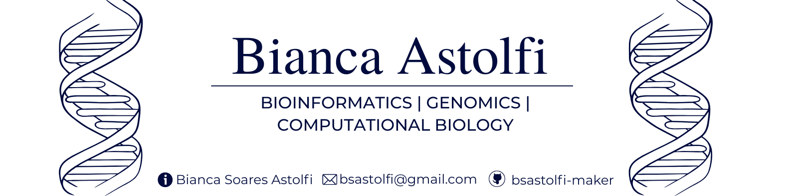

  

# 👋 Hi, I'm Bianca Soares Astolfi

### Bioinformatics • Genomics • Computational Biology

## About Me

Hello! I'm Bianca Soares Astolfi.

I hold a Master's degree in Biotechnology and Molecular Biology, with experience in molecular biology, recombinant protein production, cloning, immunological assays and structural biology.

Currently, I am transitioning into Bioinformatics, focusing on Genomics and Computational Biology.

My goal is to integrate experimental biology with computational approaches to answer biological questions using reproducible and scalable workflows.

## Research Interests
🧬 Genomics

🧬 Comparative Genomics

🧬 Functional Genomics

🧬 Sequence Analysis

🧬 Biological Data Science

🧬 Computational Biology

🧬 Structural Bioinformatics

## Previous Research Experience
✔ Molecular Biology

✔ Gene Cloning

✔ Recombinant Protein Production

✔ Primer Design

✔ PCR

✔ Protein Purification

✔ Protein Characterization

✔ Sanger Sequencing

✔ ELISA

✔ ELISpot

✔ qPCR

✔ Structural Biology

✔ Scientific Writing

## Programming 
✔ Python

✔ R

✔ Linux

✔ Git

✔ Bash

## Bioinformatic tools
✔ BLAST

✔ Biopython

✔ Galaxy

✔ AlphaFold

✔ PyMOL

✔ AutoDock

✔ Discovery Studio

✔ Clustal Omega

✔ MAFFT
